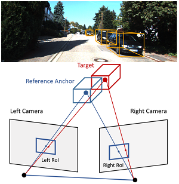

## TLNet: from Monocular to Stereo 3D Object Detection

[](https://cloud.tsinghua.edu.cn/lib/d8a4a77b-82cb-42a9-bcf0-e1d9999aeffc/file/video_demo_TLNet.mp4)

### Prerequisites
- Ubuntu 16.04
- Python 3.6
- Tensorflow 1.3.0 

### Dataset
Download the [Kitti Object Detection Dataset](http://www.cvlibs.net/datasets/kitti/eval_object.php?obj_benchmark=3d) and place it into your home folder `~/Kitti/object`. Also download the `train.txt`, `val.txt`, `trainval.txt`, `planes` and `score` from [here](https://cloud.tsinghua.edu.cn/f/af6ca62301df4f14a6e4/?dl=1). The folder `planes` contains the ground planes parameters and `score` is the ground truth 2D objectness confidence maps. The data folder should be in the following format:
```
Kitti
    object
        testing
        training
            calib
            image_2
            image_3
            label_2
            planes
            score
        train.txt
        trainval.txt
        val.txt
```

### Setup
Add `tlnet` to your PYTHONPATH:
```bash
export PYTHONPATH=$PYTHONPATH:'path/to/tlnet'
```
Run the following command to download the pretrained model, compile required modules and generate mini-batches for training:
```bash
python setup.py
```


### Training
Run the training script with specific configs:
```bash
python avod/experiments/run_training.py --pipeline_config=avod/configs/pyramid_cars_with_aug_example.config --data_split='train' --device=GPU_TO_USE
```

### Evaluation
```bash
python avod/experiments/run_evaluation.py --pipeline_config=avod/configs/pyramid_cars_with_aug_example.config --data_split='val' --device=GPU_TO_USE
```

### Inference

```bash
python avod/experiments/run_inference.py --checkpoint_name='pyramid_cars_with_aug_example' --data_split='val' --ckpt_indices=-1 --device=GPU_TO_USE
```
where `--ckpt_indices=-1` indicates running the lastest saved checkpoint. The difference between `evaluation` mode and `inference` mode is that, `inference` does not automatically perform Kitti official evaluation, while `evaluation` does.
